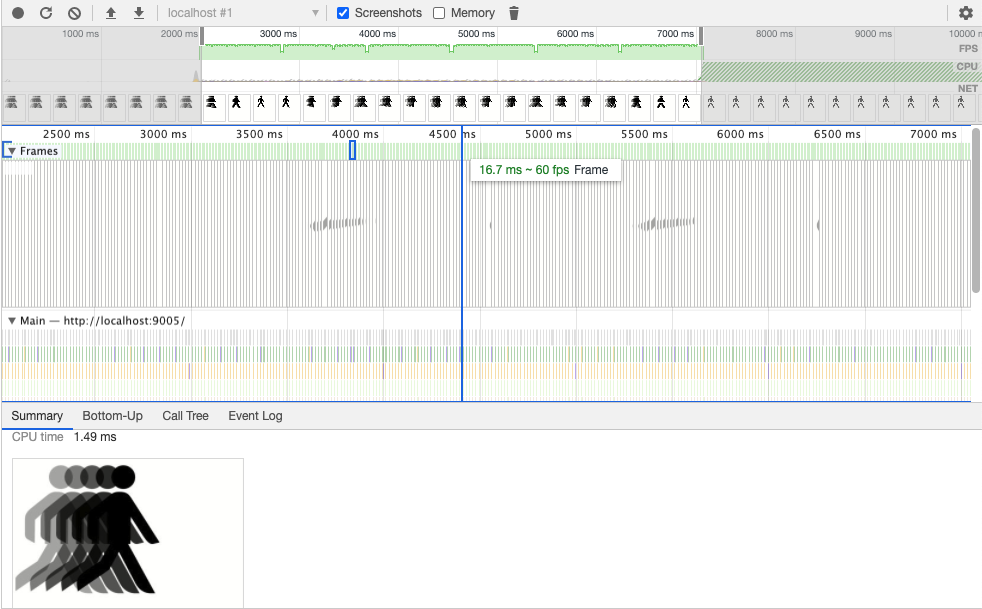

# Icon Animate
`icon-animate` Is a library of your typical web icons and your not so avarage icons that animate for any ReactJS application. They Animate right about a target of 60 FPS with
nothing but performance in mind for every icon. Majority of them are built with mainly Vanilla Javascript and very little CSS for container styling. 

## Example would be:

```js
import React from 'react';
import IconAnimate from 'icon-animate'

function App(props) {

    return (
        <>   
            // Name of your icon
            <IconAnimate icon={'nameOfIcon'}>
        </>
    );
}

export default App

```

### Achieving smooth animations


